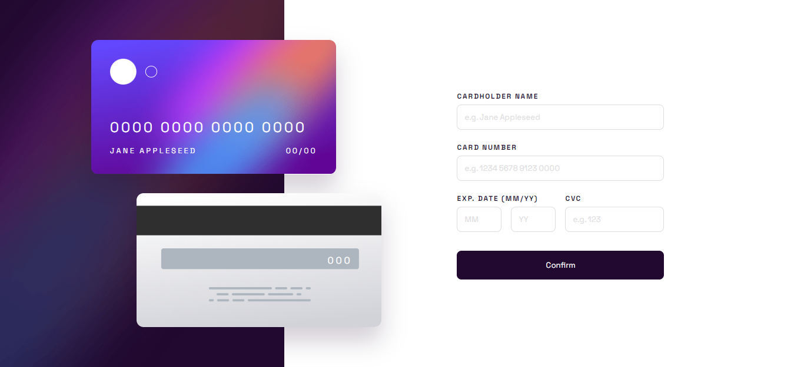
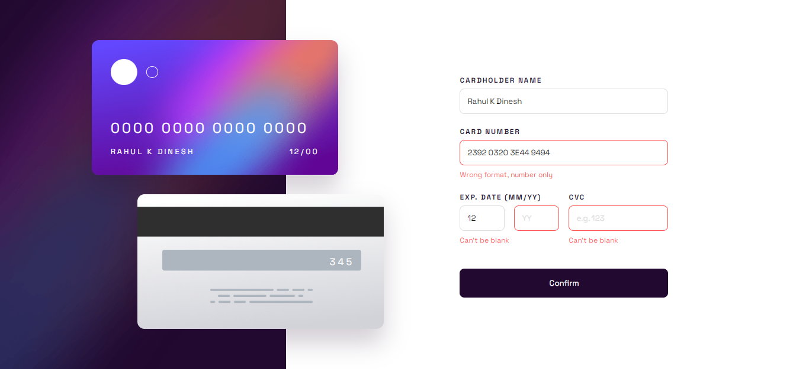
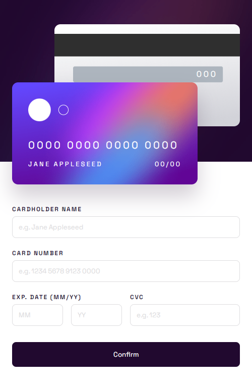

# Frontend Mentor - Interactive card details form solution

This is a solution to the [Interactive card details form challenge on Frontend Mentor](https://www.frontendmentor.io/challenges/interactive-card-details-form-XpS8cKZDWw).

## Table of contents

- [Overview](#overview)
  - [The challenge](#the-challenge)
  - [Screenshot](#screenshot)
  - [Links](#links)
- [My process](#my-process)
  - [Built with](#built-with)
  - [Useful resources](#useful-resources)
- [Author](#author)

## Overview

### The challenge

Users should be able to:

- Fill in the form and see the card details update in real-time
- Receive error messages when the form is submitted if:
  - Any input field is empty
  - The card number, expiry date, or CVC fields are in the wrong format
- View the optimal layout depending on their device's screen size
- See hover, active, and focus states for interactive elements on the page

### Screenshot







### Links

- Solution URL: [Github repo](https://github.com/b16h22/interactive_card_details_form_solution)
- Live Site URL: [Github pages](https://b16h22.github.io/interactive_card_details_form_solution/)

## My process

### Built with

- Semantic HTML5 markup
- CSS custom properties
- Flexbox

### What I learned

Learned to format input value as the user enters it with the help of regex, input eventlisteners, and string methods.

```js
const inputCardNumber = document.getElementById("input-card-number");
const inputValidityMonth = document.getElementById("input-validity-month");
const inputValidityYear = document.getElementById("input-validity-year");
const inputCvc = document.getElementById("input-cvc")

inputCardNumber.addEventListener('input', function (event) {
  if(event.inputType == "deleteContentBackward") {
    if(this.value.length == 5 || this.value.length == 10 || this.value.length == 15) {
      this.value = this.value;
    }
  } else {
    if(this.value.length < 19) {
      this.value = this.value.replace(/\W/gi, '').replace(/(.{4})/g, '$1 ');
    }
  }
});

inputValidityMonth.oninput= function() {this.value = this.value.slice(0, this.maxLength)};
inputValidityYear.oninput= function() {this.value = this.value.slice(0, this.maxLength)};
inputCvc.oninput= function() {this.value = this.value.slice(0, this.maxLength)};
```

## Author

- Frontend Mentor - [@b16h22](https://www.frontendmentor.io/profile/b16h22)
